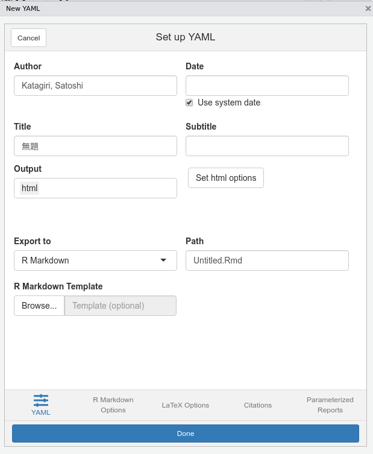
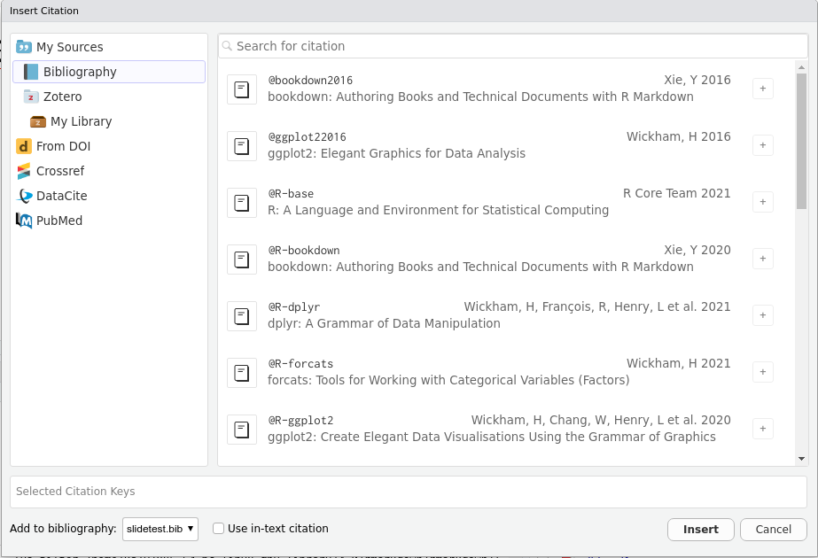

# この資料について

```{r setup, include=F}
knitr::write_bib(c(.packages(), c("rmarkdown", "bookdown", "tinytex", "ggplot2", "citr")), file = 'packages.bib')
# Office の場合は画像をSVGにする
# 非常にデータの多い散布図などはかえって重くなることに注意
if(!knitr::is_html_output() && !knitr::is_latex_output()){
  knitr::opts_chunk$set(dev = "svglite")
}
```

Tokyo.R #91 の補足資料として, スライドに書ききれなかった細かい環境設定等の補足資料です. よって想定読者は元スライドと同じです. 多くの問題は『[R Markdown クックブック](https://gedevan-aleksizde.github.io/rmarkdown-cookbook/)』, "[_R Markdown: The Definitive Guide_](https://bookdown.org/yihui/rmarkdown/markdown-syntax.html)," "[_Bookdown_]()" または **rmdja** パッケージのマニュアル (実際には雑多な技術メモ) を読むことで解決できます. 特に クックブックの[4](https://gedevan-aleksizde.github.io/rmarkdown-cookbook/document-elements.html)章は基本的な事項がまとまっていますが, 日本語圏独特の (ややニッチな) 問題も含め, ここに再編集した内容を残しておきます.

**rmdja** パッケージの機能がひとおおりまとまれば, そのうちパッケージのドキュメントとして再編集するでしょう.

# OS ごとの初期設定

## グラフィック関係

R Markdown に必須ではありませんが, 良質な文書作成のためにグラフ関連のパッケージをインストールしておくことをお薦めします. もちろん R Markdown を使わなくとも, R のグラフ作成全般で有効に使うことができます.

以下は, 特に重要です.

* **ggplot2** (**tidyverse** パッケージ内に含まれているので個別インストールしなくてもかまいません)
* **ragg**
* **fontregisterer**
* **svglite**

TODO: export は Office365 2017 以降なら使えるか?

以下はグラフのテーマプリセット等です. インストールすべきかはどちらかというと好みの問題です. https://ill-identified.hatenablog.com/entry/2021/02/03/224034 や紹介している本を参考にしてください.

* **ggthemes**
* **hrhbrhemes**
* **patchwork**

最初のグループのパッケージは外部ライブラリにも依存しています. よってお使いのPC環境によっては, R のパッケージ以外のプログラムも合わせてインストールする必要があります. 

例えば **ragg** をインストールする際 (正確には **ragg** が依存している **textshaping** パッケージ), Mac や Linux では以下のようなログが出るかもしれません. これは外部ライブラリ `harfbuzz`, `freetype2`, `fribidi` が不足しているということなので, 指示の通り, `apt`, `brew`, `rpm`  コマンドなどでインストールしてください.

```text
--------------------------- [ANTICONF] --------------------------------
Configuration failed to find the harfbuzz freetype2 fribidi library. Try installing:
 * deb: libharfbuzz-dev libfribidi-dev (Debian, Ubuntu, etc)
 * rpm: harfbuzz-devel fribidi-devel (Fedora, EPEL)
 * csw: libharfbuzz_dev libfribidi_dev (Solaris)
 * brew: harfbuzz fribidi (OSX)
If harfbuzz freetype2 fribidi is already installed, check that 'pkg-config' is in your
PATH and PKG_CONFIG_PATH contains a harfbuzz freetype2 fribidi.pc file. If pkg-config
is unavailable you can set INCLUDE_DIR and LIB_DIR manually via:
R CMD INSTALL --configure-vars='INCLUDE_DIR=... LIB_DIR=...'
```

パッケージのインストール

ここで触れるパッケージをインストールします. 以下を実行してください.


分析では定番になっているので **tidyverse** を使います.

```{r}
require(tidyverse)
```

TODO: `ggsave()` で ragg 使うとおかしくなる問題は直接関係ないが, どこかに書くべきか

## Linux (RStudio Cloud)

Ubuntu 20.04 を想定しています. RStudio Cloud も Ubuntu OS のため, ほぼ同じだと思います.

* R (>= 3.6)
* RStudio (>= 1.4.1103)
* Noto フォント
    * Ubuntu 18.04 以降を日本語版インストーラから導入したならデフォルトで入っていますが, RStudio Cloud 等には入ってません. 以下でインストールできます.
    ```bash
    sudo apt install fonts-noto-cjk fonts-noto-cjk-extra
    ```
* 各種パッケージ
* TeX 
    * TeX がなにかわからない人はとりあえず **tinytex** パッケージでインストールしてください
    * TeX Live をインストールしたい場合は `apt` ではなく tlmgr からインストールを推奨

## Mac

申しわけないですが最新版 (Big Sur) は実機を持っていないので対応できません. この要件は Cateliina で確認したものです.

* R (>= 3.6)
* RStudio (>= 1.4.1103)
* [Homebrew](https://brew.sh/index_ja)
    * 以下の XQuartz 等いろいろな外部プログラムのインストールに必要
* XQuartz
    * グラフィック表示のためにあったほうが便利です
* 各種パッケージ
* TeX 
    * TeX がなにかわからない人はとりあえず **tinytex** パッケージでインストールしてください
    * TeX Live (MacTeX) をインストール済みなら不要です

## Windows 10

* R (>= 3.6)
* RStudio (>= [**1.4.1533**](https://dailies.rstudio.com/rstudio/oss/windows/))
    * Python を使う予定がないならば, 安定版 1.4.1106 でも問題なし.

# グラフィックのフォント

OS ごとにデフォルトで入っているフォントが異なるため, 以下を想定しています.

* Linux: Noto
* Mac: ヒラギノ
* Windows: 游書体

**ragg** は最近の更新でフォールバックフォントが有効になりましたが, 以下の点に注意してください.

1. PDFでフォントを埋め込みたい場合は従来どおりフォントファミリ名の指定が必要
1. Windows のフォールバックフォントは游書体ではなく MS フォントになっている


# Python の対応状況

**reticulate** パッケージが必要です. Python 環境, OS と RStudio のバージョンの組み合わせによっては不具合が発生することがあります.

例えば以下を参考にしてください.

https://ill-identified.hatenablog.com/entry/2021/02/22/233326

Python の matplotlib でグラフを描画する場合, やはりフォントの設定がネックになります. 特に PDF で埋め込みたい場合は, デバイスを明示的に変更し, かつフォントファミリの指定が必要になります. なおこの設定は R Markdown に限らず Python 全般で有効です.

基本的には `.matplotlibrc`  の設定だけで完結しますが, 設定の変更が嫌ならば Python セッション中に設定を書き換えることもできます.

TODO

# Julia の対応状況

**JuliaCall** パッケージによって Julia セッションを呼び出すことができます.

# それ以外の言語

それ以外の言語は基本的にシステムコールとして呼び出すことになるため, チャンクをまたいで結果を保持することはできません.

それとは別にシンタックスハイライトができるので, コードの掲載には便利なはずです.

より詳しい話は 『R Markdown クックブック』の[15](https://gedevan-aleksizde.github.io/rmarkdown-cookbook/other-languages.html)章を読んでください.

# Markdown の補足

引っかかりやすいケースの Tips のみ書いておきます.

## 箇条書きをエスケープ

箇条書きをエスケープしたければ, 以下のように行頭にバックスラッシュ + スペース.

```
\ (1) 箇条書き無効化
```

\ (1) 箇条書き無効化

または, 箇条書きの記号の直後にバックスラッシュ + スペースを挿入します

```
*\ 箇条書き無効化
```

*\ 箇条書き無効化


## 箇条書きのカウンタがうまくいかないとき

ネストした際に, 数字や abc でカウントする箇条書きのカウントがリセットされることがあります. これは Markdown の仕様で, スペース4つ以上のインデントでないとネストと認識されないためです. RStudio のインデントはスペース2つがデフォルトのため, R Markdown ではハマりやすいです.

失敗例

```md
1. 1
1. 2
  * 2-1
  * 2-2
1. 3
1. 4
```

1. 1
1. 2
  * 2-1
  * 2-2
1. 3
1. 4

成功例


```md
1. 1
1. 2
    * 2-1
    * 2-2
1. 3
1. 4
```

1. 1
1. 2
    * 2-1
    * 2-2
1. 3
1. 4

箇条書きにコードブロックなどのブロック要素を入れる場合も同様に4スペース=1インデントで書く必要があります.


## 脚注の連続

脚注`^[ここに脚注]` の形式での脚注は連続して書けません. 脚注を付けたい場所に `[^脚注ID]` と書いた後, 適当な文の区切りのある場所で

```
[^脚注ID]: ここに脚注
```

というふうに本文を書きます[^fn1][^fn2].

[^fn1]: ここに脚注その1
[^fn2]: ここに脚注その2

## YouTube 動画の埋め込み

"R Markdown: The Definitive Guide" に書かれている以下の方法

```

```

は現在では**できません**. 公式の「共有」->「埋め込み」からの `iframe` タグのコピーが必要です. ただし, そのままだとソースが埋め込まれてしまい正常に動作しません. コピーしたタグに, `data-external="1"` を追加するか, 出力フォーマットに `self_contained: false` を設定します. 後者は広範囲に影響があるため, 意味を理解していないなら前者をおすすめします.

```
<iframe width="640" height="480" src="https://www.youtube.com/embed/lJIrF4YjHfQ" frameborder="0" allow="autoplay; clipboard-write; encrypted-media; gyroscope; picture-in-picture" allowfullscreen data-external="1"></iframe>
```

`<iframe width="640" height="480" src="https://www.youtube.com/embed/lJIrF4YjHfQ" frameborder="0" allow="autoplay; clipboard-write; encrypted-media; gyroscope; picture-in-picture" allowfullscreen data-external="1"></iframe>`{=html}

なお, PDFでは動画を埋め込むことはできません. Word も同様です (TODO: 確認).

## 独立行数式

`aligned` は HTML のみ. 数式付番もできない. `align` を使ったほうがいい\@ref(eq:norm).

\begin{align}
f(x) = \frac1{\sqrt{2\pi}}\exp\left(\frac{x^2}{2}\right) (\#eq:norm)
\end{align}

グラフ内の数式の出力を LaTeX 数式にしたい場合, **tikzdevice** を使うことになります. ただし, 行列など一部の数式は変換できません(図\@ref(fig:plot-example)).

```{r plot-example, fig.cap = "標準正規分布"}
ggplot(data.frame(x = c(-4, 4)), aes(x = x)) +
  geom_function(fun = dnorm, args = list(log = T)) +
  labs(y = expression("対数確率", log(p)))
```

TODO

## 相互参照

文献引用の相互参照は説明することが多いため, 後の\@ref(biblio)節でまとめます. ここではそれ以外の, 図表, 数式セクションへの参照 (いまさっき「\@ref(biblio)節」と表示してみせたもの) について言及します.

まず, 相互参照は主に **bookdown** パッケージでサポートされており, **rmarkdown** のデフォルトのフォーマットでは利用できません. これは冒頭で **bookdown** に使用をすすめた理由の1つです.

先ほどのグラフは, R コードチャンクで描いています. そしてチャンクラベルは `plot-example` です.  このとき, ラベルの頭に `fig:` を付けたものが図の参照IDになります. よって, `\@ref(fig:plot-example)` で図番号を自動で挿入できます (図\@ref(fig:plot-example)). 「図: XXXX」のキャプション部分は, チャンクオプション `fig.cap=` で設定できます.

表も同様ですが, 表のタイトルを付ける場合は `knitr::kable()` や `kableExtra::kbl()` が必要になります (表\@ref(tab:table-example)). 表を参照する場合, `\@ref(tab:table-example)` のように, チャンクラベルに `tab:` を付ける必要があります.

```{r table-example}
data(mtcars)
knitr::kable(head(mtcars), caption = "表の例", booktabs = T)
```

**kableExtra** パッケージがあると, 表を装飾できます (表\@ref(tab:table-example2)).

```{r table-example2}
require(kableExtra)
mtcars[1:8, 1:8] %>%
  kbl(caption = "kableExtra でスタイルを設定した表", booktabs = T) %>%
  kable_paper(full_width = F) %>%
  column_spec(2, color = spec_color(mtcars$mpg[1:8]),
              link = "https://haozhu233.github.io/kableExtra/") %>%
  column_spec(6, color = "white",
              background = spec_color(mtcars$drat[1:8], end = 0.7),
              popover = paste("am:", mtcars$am[1:8]))
```

https://cran.r-project.org/web/packages/kableExtra/vignettes/awesome_table_in_html.html


## より詳細な参考資料: Markdown 構文

Markdown 構文全般の説明は, Definitive Guide の [2.5](https://bookdown.org/yihui/rmarkdown/markdown-syntax.html)節などが網羅的です. Markdown にはいろいろな方言があるため, R Markdown 以外の Markdown 構文の解説は R Markdown では使えないことがあることに注意してください. 基本的に, R Markdown または Pandoc を想定した Markdown の解説を参照するとよいでしょう.


# 出力フォーマット

`output:` 欄で指定されているものを出力フォーマットといい, Rmd の出力がどんな見た目になるかは主にここで決まります.

```{yaml, eval=F}
----
output: html_document
----
```

ここに指定できるのは, 「**出力フォーマット関数**」と呼ばれる関数です. **rmarmkdown** パッケージには, 例えば以下のような出力フォーマットが用意されています.

* `html_document`
* `slidy_presentation`
* `pdf_document`
* `beamer_presentation`

## 各種フォーマット

2021/4/17 時点では, 以下がおすすめです

```{r format-tab, echo=F}
knitr::kable(data.frame(
  format = c("PDF", "HTML", "Word (DOCX)", "スライド資料 (PDF)", "スライド資料 (HTML)", "スライド資料 (PPTX)"),
  output = c("`rmdja::pdf_document2_ja`",
             "`bookdown::html_document2`",
             "`officedown::rdocx_document`",
             "`rmdja::beamer_presentation_ja`",
             "`xaringan::tsukuyomi`",
             "`officedown::rpptx_document`"
             )
), booktabs = T, col.names = c("ファイル形式", "フォーマット関数名"), caption = "フォーマット")
```

**rmarkdown** 本体の出力フォーマットが1つもありませんが, それは次のような理由です.

* デフォルトのフォーマットに対して, **bookdown** の `...2` というフォーマットは相互参照機能が追加されている
* PDF は, 日本語の文書として自然な形にするために必要な設定項目が多すぎる
* **xaringan** パッケージは, より便利な構文が追加されている


# スライドの作成

## 概論

文書だけでなくスライドも作ることができます. 有力なものとして, 以下があります.

* HTML
    * `rmarkdown::slidy_presentation`
    * `xaringan::moon_reader`
* PDF
    * `rmdja::beamer_presentation_ja`
* PPTX
    * `officedown::rpptx_document`

スライドの場合, 基本的に, セクションを表す `#` または `----` がスライドの区切りとみなされます. 


しかし, 残念ながら構文があまり統一されていないため, 直感的ではありません. たとえば基本的なフォーマット `rmarkdown::slidy_presentation`

beamer は, `#` がセクションの区切りで, 見出しのみの専用スタイルのスライドになり, `##` がスライドの区切りとみなされます. ほかはすべて `#` がスライドの区切りです.

つまり, Beamer は


```markdown
# セクション区切り

## スライド1

* ???
* !!!

## スライド2

* ?!
```

で, それ以外のフォーマットはデフォルトで


```markdown
# スライド1

## スライド1の見出し

* ???
* !!!

## スライド1の見出しその2

* ?!
```

となります. `slide_level: 2` にすることで beamer と同じ感覚で書くことができますが, **xaringan** や **revealjs** はこれができません.


## **xaringan** (写輪眼) でできること

* 本編では紹介できませんでしたが, HTML 形式のドキュメントでは **xaringan** パッケージも便利です.
* 個人的には **reveals** のスライドはブラウザバックが必要になるので好きではありません.

[**xaringanthemer**](https://pkg.garrickadenbuie.com/xaringanthemer/) パッケージは **xaringan** スタイルを拡張します. スタイルに合った **ggplot2** 用テーマも用意されていますが, 英文を想定しているので使いづらいかもしれません (~~というかクセが強すぎる~~).

ただし, Visual Editor モードでは編集できません (**xaringan** に限らず, **rmarkdown** 以外が提供しているパッケージは対応していないことがよくあります).


# YAML メタデータ


## YAML メタデータの基本構文

ここまで, タイトルや `output` しか設定していなかった YAML メタデータについて詳しく説明します.

Rmd ファイルの冒頭の `----` で囲まれた範囲は YAML メタデータといいます. この部分の構文は YAML という構文で書かれています. YAML はデータを記述するためのものですが, 例えば JSON と比べると Markdown に似ており視覚的に見やすいという利点があります. 典型的なものは

```{yaml, eval=F}
----
title: "タイトル"
output: html_document
----
```

のように, 常に `フィールド名: 値` という形で書かれます. さらに, インデントをとることでネストさせることもできます.

```{yaml, eval=F}
output:
  html_document: default
  pdf_document: default
```

これは出力フォーマットに `html_document` と `pdf_document` の2つを指定していることを意味します.

リスト (R のリストではなく, 複数の値を並べたもの, という意味) は2通りの書き方があります. 任意の数の値を与えられるフィールドに対して使います. 例えば著者が複数いる場合, 以下2つは同じです.

```{yaml, eval=F}
author: ["R太郎", "R花子"]
output: html_document
```

```{yaml, eval=F}
author:
  -  "R太郎"
  -  "R花子"
output: html_document
```

文書の概要を記入する `abstruct` フィールドなどは, 長いため1行に収めるのが難しいかもしれません. 以下のように `|` または `>` を使えば複数行にわたるテキストが1つの値とみなされます.

```{yaml, eval=F}
abstruct: |
  複数行に分けて書きたい場合は
  このようにバー (`|`) を使います
```

```{yaml, eval=F}
abstruct: >
  複数行に分けて書きたい場合は
  このように不等号 (`>`) も使えます
```

コロン (`:`) など構文で使われる特殊な記号を値に含めたい場合は, 値全体を引用符で囲んでください.

ここまでは Rmd に限らない YAML メタデータの一般的なルールです.

技術的な補足: R Markdown の YAML メタデータは Pandoc の仕様を利用しています.

## YAML メタデータでの設定

R Markdown では YAML メタデータのほとんどにデフォルト値が設定されているため, 一切書かなくても出力できる事が多いです. デフォルトでは `output: html_document` なので, HTML 形式のレポートが出力されます.

しかしおそらく最低限の設定は必要でしょう. 例えばセッションで使用したように, タイトル・著者・出力フォーマットの設定は最低限必要でしょう.

```{yaml, eval=F}
----
title: "タイトル"
author: "氏名"
output: bookdown::html_document2
----
```

R Markdown の YAML メタデータの設定で一番重要かつ, 初心者にわかりにくいのは `output` フィールドだと思われます. ここには R Markdown 出力フォーマットを指定します. 出力フォーマットとは, R の関数です. デフォルトでは `rmarkdown::html_document` が使用されます. `html_document` のように **rmarkdown** パッケージに含まれている関数は, パッケージ名を書かなくてもよいですが, それ以外は上記のように `パッケージ名::` が必要になります.

スタイルを調整したい場合の多くは, `ouput:` 以下にさらに設定をネストして書くことになります. この項目は膨大で, かつフォーマットによって異なります. しかし, 出力フォーマットは R の関数であり, 出力フォーマットにネストできる項目が引数と同じであると分かれば簡単に調べることができます. つまり, (普通は) ヘルプページが用意されています.

```{yaml, eval=F}
----
output:
  html_document:
    code_folding: hide  # コードを折りたたんで表示する
    number_sections: yes  # セクション番号を表示する
----
```

なお, R の `TRUE`/`FALSE` に対応する値は, `true`/`false`, `yes`/`no` で置き換えることができます.

YAML の記入ミスがあった場合のエラーメッセージは少々わかりにくいです.

手動の記入に自信がないなら, **ymlthis** パッケージをインストールすると, RStudio の アドインから "Write New R Markdown or YAML File"  を選んで設定用のダイアログボックスを開けます (図\@ref(fig:ymlthis)). ただし, 出力フォーマットの項目は **rmarkdown** で提供されているものにのみ対応しています.

(ref:cap-ymlthis) `ymlthis` の画面

```{r ymlthis, fig.cap="(ref:cap-ymlthis)"}

```

現状, 出力フォーマットで設定できる項目 (`output:` にネストされている項目) と, YAML メタデータのトップレベルに使用できる項目にはいくつか重複しているものがあり, 注意が必要です.


# 画像の出力

## サイズの調整

R Markdown では画像サイズを決めるのに大きく分けて2種類のパラメータがあります. Markdown 記法は既存の画像ファイルを貼り付けるものでしたが, コードチャンクでは, 内部でグラフを生成し, 画像として保存, そして文書に貼り付ける, という動作をしています. よって, 保存時のサイズと文書掲載時のサイズをそれぞれ決めるパラメータが存在します.

* `fig.width`, `fig.height` などは保存時のサイズで, **単位はインチ**です. 

* `out.height`, `out.width` などは掲載時のサイズで, **単位は出力フォーマットに依存します**. しかし基本的には余白に対するパーセント表記で決めると簡単でしょう.

これの使いにくいところは, 例えばグラフ内の文字が出力時にどれくらいの大きさになるかがわかりにくい点です.

# PDF 出力の内幕

R Markdown で PDF を出力する場合, `.md` ファイルを pandoc で `.tex` 形式に変換してから LaTeX で PDF を生成します (この作業をコンパイルといいます). このとき, LaTeX プログラムの呼び出しを **tinytex** パッケージで制御しています. 

まだ LaTeX をインストールして使用したことがない場合は, **tinytex** で簡単にインストールすることもできます.

```{r eval=F}
tinytex::install_tinytex()
```

ただしこれは**必須ではありません**. 既に LaTeX をインストールしていると**競合します**. 注意してください.

LaTeX で PDF をコンパイルする場合, 様々なプログラムを複数回呼び出す必要があります. それを制御するのが **tinytex** の役目の1つです. この役目は従来 latexmk というプログラムが担っていましたが, **tinytex** は latexmk の処理をエミュレートすることができます. その結果, エラー発生箇所の追跡が多少簡単になりました.

詳細は R Markdown クックブックの [1.2](https://gedevan-aleksizde.github.io/rmarkdown-cookbook/install-latex.html), [1.3](https://gedevan-aleksizde.github.io/rmarkdown-cookbook/install-latex-pkgs.html)節を見てください

latexmk エミュレーションを無効にする必要のある場面として, 後述する (u)pBibTeX を使用するというものがあります.

latexmk の使用法は以下が参考になります (必須ではありません).

* https://texwiki.texjp.org/?Latexmk
* http://www2.yukawa.kyoto-u.ac.jp/~koudai.sugimoto/dokuwiki/doku.php?id=latex:latexmk%E3%81%AE%E8%A8%AD%E5%AE%9A

## LaTeX の出力エンジン

R Markdown が使用できる LaTeX エンジンは基本的に以下の3つです.

1. `pdflatex` (pdfLaTeX)
1. `xelatex` (XeLaTeX)
1. `lualatex` (LuaLaTeX^[実際には LuaHBTeX])
1. `tectonic`^[**rmarkdown** >= 2.8 でサポート予定]

つまり, 基本エンジンである LaTeX2e ひいては pLaTeX (pLaTeX2e) での使用は実は想定されていません^[英語圏の開発者は必ずしも日本語 LaTeX 事情を把握していないためです: https://acetaminophen.hatenablog.com/entry/texadvent2020]. (1) は欧文での処理のスタンダードになっています. これで日本語文書をコンパイルする場合, 不可能ではありませんが難しい and 使用例が少ないため候補から外れます.  最近は日本語文書を (2, 3) でコンパイルする例が増えています. (4) は最近登場し, Pandoc もサポートするようになったため, 次にリリースされるバージョンからサポートされます. ただし, XeTeX ベースなので出力は基本的に `xelatex` と変わらないはずです. また, BibTeX/BibLaTeX, MakeIndex 等への対応も不十分なようです. よって通常は, (2, 3) のどちらかを使うことをおすすめします.

(2, 3) についてはそれぞれ特性が異なります. `xelatex` はよりコンパイルが速いですが, 和文の禁則処理の一部が甘いです. 逆に `lualatex` はより利用が活発なためか禁則処理がより厳格ですが, 一方でより処理速度が遅くなっています. それ以外にも対応している文書クラスの設定が微妙に異なるなどの違いがあります. 個人的な体感として, 短い文書であれば速度はあまり気になりません. また, スライドであれば `xelatex` の禁則処理の甘さも気になる場面が減ると思います. これも個人的な考えですが, 普段は `xelatex` を使い, 完成版は時間のかかる `lualatex` に切り替える, ということをしています^[TeX Live 開発に関わっている日本人はなるべく LuaLaTeX を使うように主張しています.]. ただし, 両者の互換性をよく理解していないとこのやり方はうまくいかないこともあります.


## R Markdown と LaTeX テンプレートの融合

あなたが独自にカスタマイズした LaTeX のテンプレートを組み込んで, R Markdown で使用できれば便利でしょう.

LaTeX のテンプレートを R Markdown から操作する3つの主な方法があります.

1. YAML メタデータの設定項目 (Pandoc の機能)
2. Pandoc テンプレートの改造
3. プリアンブルに部分的に挿入する

まず, (1) は `documentclass` および `classoption` です. それぞれ, `.tex` ファイル冒頭の `\documentclass[]{}` の文書クラスとオプションに代入されます. article, report, book といったカスタマイズは, このオプションだけで十分でしょう.

R Markdown は, knit で処理した本文と YAML メタデータを Pandoc のテンプレートに代入します. ターミナルで
    ```bash
    pandoc -D latex > latex.template.tex
    ```
    を実行してみてください. Pandoc の LaTeX 用テンプレートファイルが出力されます. これはほぼ `.tex` ファイルですが, 至るところに `$documentclass$` のような Pandoc マクロが含まれています. これは主に (1) の YAML メタデータで入力した項目が代入されます. このマクロに注意しつつあなたのテンプレートを移植することができます.  デフォルトのテンプレートは日本語出力が十分に考慮されていないことの改善や, より視覚的に優れたデザインにするため, **rmdja** はデフォルトのものを改造した独自の LaTeX テンプレートを使用しています. 詳細は『R Markdown Cookbook』[6.2](https://gedevan-aleksizde.github.io/rmarkdown-cookbook/latex-variables.html), [6.10](https://gedevan-aleksizde.github.io/rmarkdown-cookbook/latex-template.html)節や Pandoc の公式ドキュメント^[https://pandoc.org/MANUAL.html#variables-for-latex] を参考にしてください. 


マクロも自分で新規に定義できます. **rmdja** ではフォントの選択に自由と利便性をもたせるため, `jamainfont`, `jasansfont`, `jamonofont`, `jafontpriset` という YAML メタデータのフィールドを新たに定義しています.

特定のパッケージを追加で読み込むとか, 修正箇所がごくわずかなら, (3) の方法が簡単でしょう. 例えば, **kableExtra** パッケージの機能を beamer で完全に使うには, 追加のパッケージが必要と公式ドキュメント^[https://haozhu233.github.io/kableExtra/]に書かれています^[**rmdja** の beamer フォーマットでは, これらのパッケージの読み込みコマンドを内蔵済みです.].  それは YAML  メタデータに以下のように追記して実現できます.

```{yaml, eval=F}
header-includes:
  - \usepackage{booktabs}
  - \usepackage{longtable}
  - \usepackage{array}
  - \usepackage{multirow}
  - \usepackage{wrapfig}
  - \usepackage{float}
  - \usepackage{colortbl}
  - \usepackage{pdflscape}
  - \usepackage{tabu}
  - \usepackage{threeparttable}
  - \usepackage{threeparttablex}
  - \usepackage[normalem]{ulem}
  - \usepackage{makecell}
  - \usepackage{xcolor}
```

ただし, パッケージのロードの順番によってエラーが起きることもあるので注意してください. 例えば色を変えたりグラフィックをいじったりするタイプのパッケージは追加を要求される可能性が高い上に競合しやすいです.

なお, LaTeXパッケージを読み込むだけならば, 出力フォーマットの引数 `extra_dependencies` が使えることもあります (『R Markdown クックブック』6.4節).

```{yaml, eval=F}
output:
  pdf_document:
    extra_dependencies:
      - booktabs
      - longtable
      ...
      - xcolor
```

別の方法として, PDF 系の出力フォーマットの多くには `includes` 引数があります.

```{yaml, eval=F}
output:
  pdf_document:
    includes:
      in_header: preamble.tex
      before_body: before-body.tex
      after_body: after-body.tex
```

カスタマイズの多くはプリアンブルでなされるので, 設定を記入したファイルを別に作り, `in_header: preamble.tex` のように指定します. `before` は `document` 環境, つまり本文開始直後に挿入されます. よって洋書によくある冒頭のエピグラフや「誰々に捧げる」的な文章や, あるいはロゴマークを挿入するのに使えます. `after_body` も本文の最後に挿入されます. PDF版にのみ巻末索引や付録を付ける場合に使いますが, これらは他の方法でも代替可能 (cf. `knitr::is_latex_output()` で条件出力させる) であることが多いのであまり使わないかもしれません.

`include-headers` と `includes` の違いは, 前者はトップレベルの YAML メタデータなので PDF 以外のフォーマットにも入力されるということです. ほとんどの場合は無害ですが, もし HTML と PDF で異なる入力が必要な場合, `includes` を使うことになるでしょう. また, LaTeX とそれ以外のソースを別ファイルに分けることは保守性の改善につながるかもしれません.


::: {.infobox .tip data-latex="{tip}"}
フォーマットによっては,  `in_header` が `header-includes` を上書きしてしまうことがあるので注意してください.
:::

ただし, (u)pLaTeX など R Markdown が対応していない LaTeX エンジンに依存したテンプレートの場合, これだけでは「knit ボタンで一発コンパイル」ということはできません, 残念ながら. それは次のセクションを参考にしてください.


## サポート外の LaTeX エンジンを使用する

昔からある (u)pLaTeX などでのコンパイルを前提としたテンプレートを使う必要のある場面も多いと思います. これらを使うには, 前節で少し触れたように, latexmk エミュレーションを無効にする必要があります. これには2つの手順が必要です.

1. エンジンを
2. パッケージオプションの設定変更
    ```{r, eval=F}
    options(tinytex.latexmk.emulation = F)
    ```
3. (オプション) `.latexmkrc` ファイルを設定し, 作業ディレクトリに配置する

この設定はつまり, latexmk エミュレーションを無効化し, かつ latexmk の設定を書き換え, pdflatex での処理を想定していたものを `platex` (`uplatex`) の処理でオーバーライドしてしまうものです. (1) のコマンドはチャンクオプションのどこかで実行できれば機能します. (3) は **rmdja** パッケージの出力フォーマットを使用する場合, 自動でなされます. それ以外のケースでは, https://texwiki.texjp.org/?Latexmk の設定を参考にしてください. または,  パッケージにも同様の設定ファイルが含まれています.

TODO: これ本当にできるの?

なお, latexmk エミュレーションを無効にした場合, もしエラーが発生した場合は原因を探すのがやや難しくなります.

うまくいかない場合は, `keep_tex` を設定して .tex ファイルを残すようにして, 手動でコンパイルするという手もあります.

```{block}
現時点では, `rmja::beamer_presentation_jp` は XeLaTeX と LuaLaTeX のみの使用を前提としており, それ以外のサポートの予定はありません. プレゼン資料については体裁の厳格な制約がないものと考えているからです.
```


# 参考文献スタイルのカスタマイズ {#biblio}

## 参考文献設定の基本事項

参考文献リストの出力方法は以下の4通りの方法があります.

1. `default` (CSL)
1. `natbib` (BibTeX)
1. `biblatex` (BibLaTeX)
1. 手動で書き込む

\ (4) は文字通りなので省略します. (1 - 3) は文献データベースに登録したものを, 本文の引用されたものだけを自動的に取り出して一覧を出力します.


\ (1) は HTML, PDF, Word いずれにも使えます. (2, 3) は PDF のみです.

共通箇所は YAML で, 出力スタイルの設定と, `bibliography` フィールドで文献データベースファイルを指定することです.

```{yaml, eval=F}
output:
    XXX_output:
      citation_package: ENGINE
bibliography: REFS.bib
```

`ENGINE` には上記の3つのどれかを指定します. `REFS.bib` は文献データベースファイルです. 対応可能なファイル形式は RStudio の公式ページの一覧を確認してください.

https://rmarkdown.rstudio.com/authoring_bibliographies_and_citations.html

また, `default` の場合に限り, YAML メタデータ内に文献情報を書けるインライン参考文献リスト (inline references)  の構文が使用できます. 例えばこのように書きます.

```{yaml, eval=F}
references:
  - type: article-journal
    id: WatsonCrick1953
    author:
    - family: Watson
      given: J. D.
    - family: Crick
      given: F. H. C.
    issued:
      date-parts:
      - - 1953
        - 4
        - 25
    title: 'Molecular structure of nucleic acids: a structure for
      deoxyribose nucleic acid'
    title-short: Molecular structure of nucleic acids
    container-title: Nature
    volume: 171
    issue: 4356
    page: 737-738
    DOI: 10.1038/171737a0
    URL: https://www.nature.com/articles/171737a0
    language: en-GB
```

しかし, 基本的には `.bib` 形式で書いたほうが使いまわしやすいため, **`.bib` 形式のファイルを使うことを推奨します**. よって, 以降の解説も `.bib` ファイルがあるという前提になっています.

特に PDF の出力で, BibTex/BibLaTeX を使用する場合 `.bib` 形式の文献データベースファイルしか読み込むことができません.  これまで LaTeX を使ったことがない, 従って BibTeX も BibLaTeX も使ったことがない, という方は, まずはお持ちの文献リストを `.bib` ファイルに変換する方法を調べて下さい.

Zotero や Mendeley といった文献管理ソフトの多くには, `.bib` ファイルをエクスポートする機能があります (前者は better bbx というプラグインも必要です^[Zotero の設定については以下を参考にしてください. https://ill-identified.hatenablog.com/entry/2019/03/05/195257]) また, CiNii や Google Scholar, あるいは国際学会・学会誌のレポジトリの多くには論文の書誌情報を `.bib` 形式でエクスポートする機能があるはずです.


文献引用の練習がしたい場合,  `knitr::write_bib(x = c("パッケージ名"))` が便利です. これはパッケージ情報を `.bib` 形式で出力します.

文献データベースが設定できればあとは文中で引用するだけです. `@文献ID` (@R-rmarkdown), または `[@文献ID]` ([@R-bookdown]), `[-@文献)ID]` ([-@R-citr]) という Markdown 構文が使えます. さらに, セミコロン (`;`) で区切って複数文献IDを同時に指定できます.   一部の分野では引用が上付き文字^aのようになっているところもあると思います. そのようなケースは CSL 等文献スタイルファイルで制御すると想定されています. PDF 限定でなら, LaTeX コマンドも使えます.

文献IDをいちいち覚えるのが嫌だという方は, **citr** パッケージによる RStudio アドインが便利です "Insert Citation" を押してください^[ただし, bib ファイルの更新を手動で行う必要や, bookdown のように文書を分割しているとうまく動作しなかったり, ややクセがあります.]. Visual Markdown Editor でも "@ citation" というボタンを押すとリストが表示されます. こちらは Zotero 等の外部ソフトウェアとの連携や, DOI, PubMed ID などで文献検索もできます (図\@ref(fig:vme-citation)).

```{r vme-citation, fig.cap="Visual Markdown Editor による引用リスト"}

```

参考文献リストのスタイルに拘らないのなら, 設定は以上で十分です.  以降の記述は, おそらくは体裁のルールが細かく決まっている, 例えば, 

* [1] (著者名) "タイトル (ここは_イタリック体で_)," (出版年), (雑誌名), ...
* (著者名) (出版年) 『タイトル (ここは太字で)』, (雑誌名), (巻数), ...

といったふうに細かく決まっている学会・ジャーナルを想定した解説になります. 国内の場合, おそらくこれに加えて和・欧文献で引用スタイルが個別に決められていることが多いと思いますので, そのことを念頭に置いた解説をします. 

また, 欧文であれば, [**rticles**](https://github.com/rstudio/rticles) パッケージに既にご専門の分野のテンプレートが作られていないかも確認するとよいでしょう.


引用全般について『R Markdown クックブック』の[4.5](https://gedevan-aleksizde.github.io/rmarkdown-cookbook/bibliography.html)節が参考になります.

## `default` (CSL)

CSL は Microsoft Word でも利用されている文献スタイルフォーマットです. よって, すでに Word をお使いの場合はこのスタイルを使い回すことができます. 特にスタイルにこだわりがないのなら, CSL が最も簡単です. スタイルを指定する場合, 以下のように CSL 形式で記述されたファイルを指定する必要があります.

```{yaml, eval=F}
output:
    XXX_output:
      citation_package: default
bibliography: REFS.bib
csl: my-style.csl
```

この `my-style.csl` に対応するファイルは, 自分で用意する必要があります. 例えば https://www.zotero.org/styles に IEEE や APA など欧文向けの様々なファイルが配布されています.

### CSL のカスタマイズについて

CSL そのものは XML の構文で書かれおり, https://editor.citationstyles.org/ のようなエディタで作ることができ, Zotero によって共有することもできます. 

CSL はローカライズには対応していますが, それはスタイル全体で同じ言語を使うことが前提です. 多言語対応に関する開発者らの公式見解としては「文献単位のローカライズは未対応^["CSL doesn’t yet allow for per-item localization," https://citationstyles.org/authors/ さらに具体例として日本語ではよくそのようなスタイルを要求されることが名指しで挙げられています.]」とのことです.  CSL 開発者らは, この問題に対する代替案として Juris-M の使用を提案しています.


(英語ですが, 該当パートのみすでに第三者により日本語訳されています)

https://juris-m.readthedocs.io/en/latest/tutorial-ja.html

少し技術的な話: PDF の場合は, pandoc-citeproc という Pandoc フィルタを使って, 文献情報を直接書き出します.


## `biblatex` (BibLaTeX)

BibLaTeX は PDF 出力の場合のみ有効ですが, LaTeX マクロを使用できるため, CSL に比べてより複雑な組版処理ができます. 典型的な YAML の記述は以下のようになります.

```{yaml, eval=F}
output:
    XXX_output:
      citation_package: biblatex
bibliography: REFS.bib
biblio-style: ieee
biblatexoptions: bibstyle=jauthoryear,citestyle=numeric,natbib=true
```

なお, HTML の場合のために `csl` フィールドも同時に書くことができます.

新たに登場した2つのフィールドはいずれも任意であり, 必須ではありません. `biblio-style` は文献リストの体裁を決めるスタイルファイルを指定するフィールドです. デフォルトでは `numeric` か `authoryear` が使われます. `biblatexoptions` はスタイルに関するオプションです. 例えば 上記の例では, 文献リストのスタイル (`bibstyle`) と引用のスタイル (`citestyle`) をそれぞれ別のものに設定し, かつ `natbib.sty` の構文を使えるようにしています (`natbib.sty` については BibTeX の項目参照). この場合, `biblio-style` の設定は文献・引用の両方のスタイルを一括して指定していますが, `bibstyle`, `citestyle` の設定によってそれぞれ上書きされています. その他にも多くのオプションが存在します. 詳細は BibLaTeX のドキュメント等を確認してください.

BibLaTeX は後述の BibTeX の後継プログラムです. 体裁の設定が LaTeX マクロで定義されているため, (多少) 設定が簡単になりました. BibLaTeX か BibTeX かでいうと, 基本的にはこちらを使ったほうが便利ですが, **日本語向けのテンプレートはまだ充実していない**というのが現状です.

BiBLaTeX の機能としては, オプション指定のみでいろいろなテンプレートに切り替えられますが, それらは言語別の設定を考慮していません. 特に姓名の順序は日本語とそれ以外で逆転して書くことが多いですが, これも想定されていません. そこで, **rmdja** パッケージでは**デフォルトで和欧を分けたスタイルテンプレート, `jauthoryear.bbx` をロードして使用するようにしました**. デフォルトでスタイルを指定しない場合, 自動でこのスタイルファイルがコピーされ, knit 時に使用されます. このファイルをそのまま使ったり, これを元に必要な体裁に改造したりしてください.

欧文限定ならば, BibLaTeX の主要フォーマットは Overleaf にサンプルが掲載されています.

https://ja.overleaf.com/learn/latex/Biblatex_bibliography_styles

または, 私の以前書いたブログ記事を参考にしてください.

https://ill-identified.hatenablog.com/entry/2020/09/20/231335


文献データベースは `.bib` とほぼ同じものが使えますが, `jauthoryear` で適切に表示するには以下の2つのフィールドへの記入が必要です.

a. `language` フィールド
a. `yomi` または `sortname` フィールド

\ (a) は和・欧の分類のために必要で, それぞれ `Japanese`, `Engilish` と入力してください (他の言語でもたぶん大丈夫です. 保証はしませんが). 例えば BibTeX の `jecon.bst` は文字コードから言語を判別していましたが, 現時点では `jauthoryear` にそのような機能はありません.

\ (b) は従来の BIbTeX の `yomi` と同様に, 五十音順を決定するための読みがなを記入するフィールドです. BIbLaTeX では一般には読みによる掲載順は `sortname` フィールドで指定しますが, `jauthoryear` では日本語圏での BibTeX との互換性を考え `yomi` フィールドでも代替できるようにしています. もちろん五十音順でなくてもよいのなら記入しなくてもかまいません. 例えば Zotero ではその他欄に `tex.yomi: ...` と記入することでエクスポートにも反映されます

詳細は私の以前書いたブログ記事を参考にしてください.

https://ill-identified.hatenablog.com/entry/2020/09/20/231335

natbib オプションを使用します.

## `natbib` (BibTeX)

BibTeX も PDF でのみ有効です. R Markdown では `natbib` という名称になっています. これは `natbib.sty` という LaTeX パッケージを使用しているからです. `natbib.sty` は `[1]` のような番号形式や, `著者 (年)` 形式などいろいろな表示形式をサポートしています. R Markdown では基本的に `natbib` と BibTeX がセットになっています. 典型例としては以下のような YAML メタデータを書くことになります.

```{yaml, eval=F}
output:
  XXX_document:
    citation_package: natbib
bibliography: REFS.bib
biblio-style: ieee
```

BibLaTeX 同様に, HTML の場合のために `csl` フィールドも同時に書くことができます.

`natbib.sty` は, 例えば `\citet{引用ID}` でテキスト形式引用, `\citep{引用ID}` で括弧で囲んだ引用, `\citeyear{引用ID}` で発表年のみ, あるいは `prettyref.sty` や `refstyle.sty` と併用することで `図XX` のように書式付きの引用を行うことができます.^[例えば Overleaf のページ https://www.overleaf.com/learn/latex/natbib_citation_styles に解説があります. 日本語ですとこのページに出力例があります. http://otoguro.net/home/latex/bibtex/] ただしこれらは LaTeX コマンドであるため, HTML では反映されません. PDF と HTML で出力を両立させたいなら, Markdown 構文の `@引用ID`, `[@引用ID]` を使用してください.^[実際にはこれら2つは PDF 出力時に Pandoc によって内部でそれぞれ `\cite`, `\citep` へと変換されています.]

BibTeX の場合, 引用スタイルを決めるのは `natbib.sty` で, 文献リストのスタイルは `.bst` ファイルによって決まります.

日本語圏では BibTeX を改造し日本語に対応させた pBibTeX または upBibTeX が最もよく利用されます. しかし, これらは LaTeX を制御する **tinytex** の latexmk エミュレーションが**対応していません**し, **`.bst` ファイルは BibLaTeX と互換性がありません**. さらに, 日本語を想定した `.bst` ファイル (典型例, `jipsj.bst`, `jplain.bst`, `jecon.bst`, などなど) の多くは **BibTeX とも互換性がなく, 多くの場合は BibTeX の処理中にハングアップします**.
 
よって, 日本語を想定した `.bst` ファイルを使う場合, `natbib` でも `biblatex` でも動作しないことになります. そこで latexmk エミュレーションを無効にする必要がありますが, v.0.4.5 以降の **rmdja** が提供する PDF 系の出力フォーマットでは `natbib` を指定した場合に自動でこれが無効にされるため, **手動での手続きは不要です**. もし `natbib` にしつつ エミュレーションを有効にする必要がある場合^[これはまれだと思います. 本当に必要なのかよく確認して下さい.] は, 出力オプション `latex.emulation = T` を設定してください.


このように, `.bst` ファイルを使う場合は処理がややこしいため, 論文誌や学会がスタイルのルールを課していない場合は CSL や BibLaTeX にしたほうが簡単です.

TODO: natbib.sty のオプションについても書くべきか

https://bookdown.org/yihui/rmarkdown/pdf-document.html

# その他

* inludes-headers は全てのフォーマットで読み込まれるため, HTML と LaTeX それぞれで設定が必要な場合は出力フォーマットの `includes`, `md_extensions`, `pandoc_args` などを使う
* YAML のトップレベルの設定は Pandoc に送られるが, この中には出力フォーマットと重複する項目がいくつかある

やや大雑把だが, この問題の原因について解説した記事

https://ill-identified.hatenablog.com/entry/2020/09/05/202403

これは Pandoc のシステムを使いまわしているためなので, R Markdown のインターフェースを変えてしまえば問題がない

## どうしても **rmdja** を使いたくないが, PDF で (日本語文書を) 出力したい

以下のような設定で, 最低限ですが動きます. ただし細部のスタイルが不自然だったり, 凝ったことをやろうとするとうまくいかないことがあります.

TODO

通常の文書 (論文, レポートなど)

```{yaml, eval=F}
----
output:
  pdf_document:
    latex_engine: lualatex
documentclass: ltjsarticle
----
```

プレゼン資料 (beamer)

```{yaml}
output:
  beamer_presentation:
    latex_engine: lualatex
```

## ハマりがちな LaTeX エラー


### Unable to read an entire line

```
Unable to read an entire line---bufsize=200000.
```

1行あたりのバッファオーバー. 巨大な画像貼り付けすぎか, R のコードミスで意味不明な長大文字列を出力してるとか.

###  Illegal parameter number in definition

```
! Illegal parameter number in definition of \iterate.
<to be read again> 
                   e
```

たぶん数式の相互参照がおかしい.

ヒューマンエラーだけでなく, visual editor 使っていると勝手に変換されることがある?

### 画像のエラー

SVG をそのまま貼り付けようとした. LaTeX は `.svg` をそのまま貼ることはできないので, `dev=svglite` にするとうまくいかない. pdf, png 等他のフォーマットに変換する必要.


## `rmdja::beamer_presentation_ja` で Fira Sans がどうこうという警告がうざい

rmdja では metropolis テーマを想定しています. このテーマは

1. シンプルで従来の beamer テーマと比べ古臭くない (個人の感想です)
1. 比較的
1. 日本語対応が簡単

という理由で採用しています

たぶんこんな警告が出ます.

```log
1: Package beamerthememetropolis Warning: Could not find Fira Sans fonts on input 
line 95.
Package beamerthememetropolis Warning: Could not find Fira Mono fonts on input 
line 95.
```

文字通り Fira Sans, Fira Mono フォントがインストールされていないときに発生する警告です. 基本的に無害ですが, 気になるならインストールしてください. Google Fonts で無料配布されています.


https://fonts.google.com/specimen/Fira+Sans

https://fonts.google.com/specimen/Fira+Mono

## スクリプトで R Markdown をコンパイルする

R Studio で 「Knit」ボタンを押すことでできる文書のコンパイルは, R のスクリプトでも可能です. 例えば:

```{r, eval=F}
rmarkdown::render("input.Rmd", output_format = rmarkdown::html_document(code_folding = "hide"))
```

逆に言えば, 「knit」ボタンは裏でこのコマンドを呼び出しているということです. 微妙に設定を変えた文書を複数作成したい場合は, これが役立つかもしれません.

## R Markdown コンパイル処理の内容

`output_format` の各引数は次のような順番で評価されます. 各処理は関数として与えることに注意してください. つまり, いわゆる generating function です. 対話的なプログラミングに慣れていると, 各処理が実際に実行されるタイミングで環境がどうなっているかを考える脳の部分が衰えているかもしれませんが, がんばってください.

既存の出力フォーマットのなかにはデフォルトで処理が設定されているものもあるため, `pdf_document` など既存の出力フォーマットを改造する形で作成する際は注意が必要です. 単純に上書きしてしまうと意図したとおりにならないことがあります. 

1. `pre-knit`
    * knit コマンド実行前の knit のオプション設定ステップ
1. (knit 実行)
    * `knitr` で Rmd 内の設定を無視して書き換えることもできます
1. `post_knit`
1. intermediates_generator
1. `pre_processor`
    * YAML メタデータやソースファイルの場所などを引数に取る関数です
    * よって, Pandoc に渡す引数などを書き換えることができます
    * **rmdja** で日本語特有の環境に対応するための小細工も主にここで行っています
1. (Pandoc 実行)
1. `post_processor`
    * `pre_processor` と同じ引数を持つ関数を与えられます
1. `clean_supporting`
    * 中間ファイル削除ステップです
    * Rmdに必須の中間ファイルはデフォルトで削除されますが, ここまでの処理で一時ファイルを作成する処理を作った場合, ここで削除するのがスマートです
1. `on_exit`

詳細は公式ドキュメントまたは kazutan 氏の解説スライドを見て
さい.

http://kz-md.net/stat/tmp_box/intoTheRmarkdown.html#/

なお Shiny との統合は

## HTML 版の印刷時に色が消える

最近投稿されたやつ

セルの背景色とかが消える

これは, R Markdown の HTML 出力のスタイルの多くが Bootstrap というライブラリに依存しており, この設定が印刷時に背景色を無効にするようになっています. インクの節約の観点から, 嫌がらせ目的ではないと思いますが, 一方でブラウザの表示のまま印刷したい場合もあります.

CSS に `background-color: 色名 !important` のように設定すれば印刷時にも背景色が反映されますが,  **formatter** など一部の作表パッケージはこのことを考慮していません.

**rmarkdown** の標準は `knitr::kable()` で, それを拡張した  **kableExtra** を使うのが無難だと思います.

他にも **flextable**, **huxtable**, **gt** といった R Markdown を想定したパッケージがあります. これらはより革新的な機能を搭載していることが多いですが, そのぶん開発途上だったり堅牢さに問題があることがあります. Yihui 氏の思想としては表の装飾にあまりこだわるべきではないということなので,

それ以外にも R Markdown には便利な機能が多くあります. 例えば **kableExtra** パッケージを始めとする作表用パッケージ, ...

しかし全てをここで紹介するのは難しいので, おいおいどこかで公開していきます.

```{r, results="asis", reftitle, echo=F, eval=!knitr::is_latex_output()}
knitr::asis_output("# 参考文献")
```