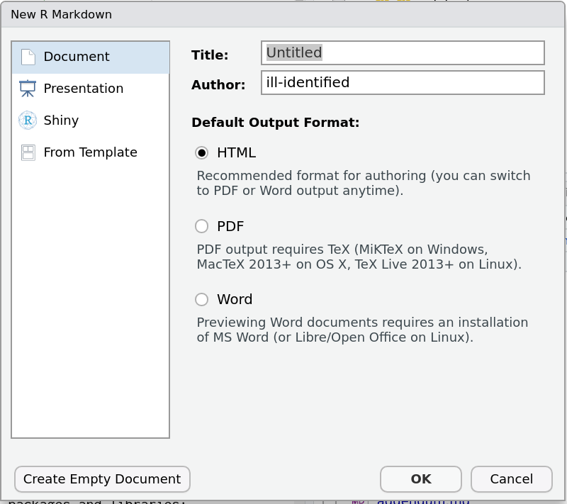
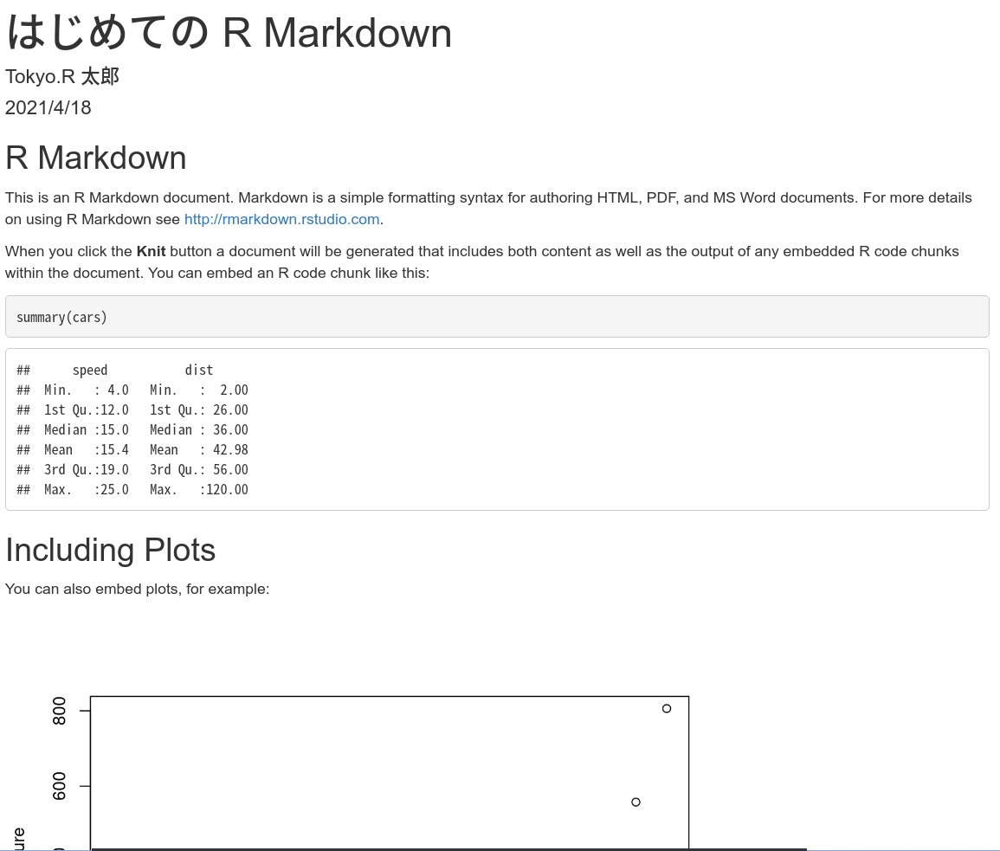

```{r setup-document, include=F}
require(tidyverse)
require(kableExtra)
require(ggthemes)
juliainstalled <- "JuliaCall" %in% installed.packages()
if("reticulate" %in% installed.packages()){
  pythoninstalled <- !is.null(reticulate::py_discover_config())
 } else {
  pythoninstalled <- F
 }
knitr::opts_chunk$set(cache = F)
```

# アジェンダ

## このスライドの想定読者

1.  R を始めたばかりの **初心者**

    -   そもそも R Markdown (RMD) って何? という人

2.  R Markdown を**試したけどうまくできなかった**人

    -   出力がおかしい/エラーが出る

3.  R ユーザーで**技術文書や論文**を効率的に書きたい人

4.  **R 以外の言語**でそれをやりたい人

    -   特に Python と Julia で計算している人
    -   `r rmdja::texlogo("LaTeX")` で論文/レポート書のが難しいという人
    -   Jupyter でレポーティングはやりづらいと感じている人

## (自己紹介) この登壇しているオジサンはそんなに詳しいの?

-   [**fontregisterer**](https://github.com/Gedevan-Aleksizde/fontregisterer) 作成者
-   "*R Markdown Cookbook*"
    [翻訳](https://gedevan-aleksizde.github.io/rmarkdown-cookbook/)者

## 今回触れる内容

-   R Markdown とは
-   R Markdown でなにができるの
-   RStudio での設定方法
-   Markdown の記法
-   コードチャンク の説明
-   HTML/PDF/WORD への出力
-   その他発展的話題
    * 時間がなかったら中断します


```{=html}
<!-- 
Markdown 記法 -> 
R チャンク -> Python や Julia も使えること強調
-->
```
## 逆に触れない内容

-   R Markdown や knitrの内部処理の詳解

-   個別の事例

    -   XX学会の論文フォーマットを作りたい

    -   細かすぎるテクニック

        -   脱線したらツッコミ入れてください

-   これらは最後に参考文献の紹介するのみ

# R Markdown とは

## こんな経験はありませんか? (1/2)

1.  実験結果からグラフ画像を作成し Word/LaTeX 原稿に貼り付け

2.  修正が必要になったので再作成して貼り付け

3.  とおもったら**原稿に反映し忘れ**

4.  そして......死

## こんな経験はありませんか? (2/2)

1.  数字を `r rmdja::texlogo("LaTeX")` のかっこいい表にしたい
2.  `r rmdja::texlogo("LaTeX")` 構文が複雑過ぎる
3.  そして......死

## R Markdown の機能概要

-   **文字通り R + Markdown**

-   簡単な構文でリッチテキスト文書を作成するツール

    -   Webサイト, 発表スライド, PDF形式の文書, レポート等

-   R プログラムの埋め込み

    -   Rが生成したグラフ・表・計算結果などを文書に直接掲載
    -   **手動コピペ不要**

-   **rmarkdown** パッケージとして提供されている

    -   機能拡張パッケージも多数

-   内部処理の技術的な話は以下参照

    -   R Markdown Cookbook 2章
    -   [kazutan のスライド](https://kazutan.github.io/HijiyamaR6/intoTheRmarkdown.html#/) (これも RMD製のはず)

# R Markdown でなにができるの

## R Markdown なんて面倒くさいだけでしょ?

-   Q.: Word やパワポ/Keynoteみたいに操作できないんでしょ?

    -   WYSYWIG じゃないとわからない

-   Q.: Overleaf とか LyX 使ってるからいいや
    - 熟練の LaTeX 使い
-   Q.: Jupyter で十分じゃないの?

    -   注: Jupyter は R とかも一応使える

## Q.: Word やパワポ/Keynoteみたいにできないんでしょ?

A.: **ビジュアルエディタモード**あるよ

## Q: Overleaf とか LyX 使ってるからいいや

A.: 毎回使う LaTeX コマンドは数式だけでしょ?

## Q: Jupyter で十分じゃないの?

-   A: RMD にも類似した Notebook という機能あり
    -   むしろ Jupyter はワードプロセッサ機能が弱い
    -   例: コードが長すぎてスライドで見切れる


## RMDで何ができるの? =\> スライドを作成できる

-   **今見ているスライド** (PDF) も全て R Markdown で作成

    -   `r rmdja::texlogo("LaTeX")` の `beamer` を経由

-   HTML 形式も可

    -   **xaringan**, **reveals** など

## RMDで何ができるの? =\> 本を出版できる

-   『R Markdown クックブック』
    - 翻訳版も R Markdown 製
-   商業出版の例

    -   Hadley et al. "[*R for Data Science*](https://r4ds.had.co.nz/)"
        (『Rで始めるデータサイエンス』)
    -   Hearly "[*Data Visualization*](https://socviz.co/)"
        (『データ可視化入門』)

-   「技術同人誌」

-   <https://bookdown.org/> はクローリングサイト

```{r, fig.cap="ここに各タイトルの画像"}

```

## RMDで何ができるの? =\> 料理書が書ける

```{r}

```


# R Markdown のハンズオン風チュートリアル

## 

-   以降はチュートリアル風に進行
-   徐々に高度な機能を使いこなせるようになりましょう

## 最初に用意するもの

-   OS: Windows 10 or Ubuntu 20.04 or macOS *Catalina*
-   最新の R (\>= 4.0.5)[^1]
-   最新の RStudio (\> 1.4.11)[^2]
-   rocker で統一してもいいが自分が~~面倒がって~~使ってないのでマルチプラットフォームで  

[^1]: Windows 以外はあまり気にしなくていい
[^2]: Windows かつ Python 使う人は daily builds

## 必要パッケージ

{height="20%"}
{height="20%"}
{height="20%"}
{height="20%"}
{height="20%"}

-   **rmarkdown**, **bookdown**, **remotes**, **rmdja** パッケージ

    -   Python を使うなら **reticulate** も必要

    ```{r, echo = T, eval = F}
    install.packages(c("rmarkdown", "bookdown", "remotes"))
    remotes::install_github("Gedevan-Aleksidze/rmdja")
    ```

-   LaTeX (PDFが必要な場合)

    -   実インストールなら **tinytex** パッケージ

    ```{r, eval=F}
    tinytex::install_tinytex()
    ```

## パッケージ等のダウンロード

* [ここ](https://rpubs.com/ktgrstsh/755893)に補足資料を上げました.
* [ここ](https://github.com/Gedevan-Aleksizde/tokyor-91-rmd)にソースがあります.
* `rmd-setup.R` を参考にしてください.


```{r}

```

## R Markdown の新規作成 (1/3)

1. R Markdown... を選ぶ

```{r}

```

## R Markdown の新規作成 (2/3)

2. HTML を選ぶ

```{r}

```

## R Markdown の新規作成 (3/3)

3. `title:`, `author:` を書き換える
    ```{r}
    
    ```
4. 適当なファイル名で保存
5. 上の "Knit" ボタンでコンパイル

## できた!

```{r}

```

... **これだけじゃメモ帳と変わらないじゃん!**

# Markdown

## Markdown の基本

-   Markdown は「マークアップ言語」

    -   HTMLタグとか, テキストを装飾し,
        「見出し」「段落」など意味を与える
-   シンプルなので視覚的に分かりやすい
    -  HTML のようにタグがゴチャゴチャしてない
    -  メモ帳と同じ感覚で使える

-   **方言**が多い点に注意

    -   例 GitHub, Slack

## Markdown の代表的な構文: 行内要素

-   文のスタイルを部分的に変更する

1.  文字のスタイル

    -   「`**太字**`」 -\> 「**太字**」
    -   「`*斜体/イタリック Itacic*`」 -\> 「*斜体/イタリック
        Itacic*」[^3]
    -   `**`/`*` の代わりに `__`/`_` も可
    -   `1 + 1` (バッククオート) でタイプライタ体 `1 + 1`
    -   「`~~打ち消し線~~`」-\> 「~~打ち消し線~~」

[^3]: 日本語は対応してないこともある

## Markdown の代表的な構文: 行内数式

2.  LaTeX 数式

    -   「`$f(x)$`」 -\> 「$f(x)$」

3. 独立行なら `$$` で囲む
    * または, `align` など直接 LaTeX を書く

## Markdown の代表的な構文: ブロック要素 (1/2)

- テキストのまとまりを定義する

1.  行頭に「`#`」で見出し `# 第1章: 序`

    -   `#` を増やすと階層が深くなる
    -   このスライドのタイトルは `##`

2.  行頭に「`*`」で箇条書き

    -   直後のスペース必須
    -   インデントで階層化可能
    -   インデントは **tab 2個** (スペース4つ) 以上[^4]

3.  「`1.`」 or 「`a.`」で番号付き箇条書き

    a.  これもインデント可
    b.  番号を書かなくても**自動で調整**

[^4]: RStudio のデフォルト設定のため

## Markdown の代表的な構文: ブロック要素 (2/2)

4.  コメントアウトは HTML 方式 `<!-- ここは出力されない -->`
    <!-- ここは出力されない -->

5. 見出しブロック (Beamer のみ)

::: {.alertblock data-latex="{これは警告です}"}
これは `alertblock` 環境
:::

-   表を記述することもできるが省略
-   わかりにくかったらこのスライドの Rmd ファイルで見てね

## Visual Markdown Editor

* どうしても苦手なら Word のような編集モードあり
* 右上のコンパスマークをクリック

```{r}
knitr::include_graphics(c("img/visual-editor1.png", "img/visual-editor2.png"))
```

# R コードの埋め込み

## コードチャンクと行内コード

-   R コードの埋め込みは2種類
-   独立したブロックとしてのコードチャンク
    -   表やグラフの埋め込み
    -   ソースコードの掲載
    -   その他複雑な処理
    -   他のプログラミング言語も使用可能

-   簡単な1文だけのコードの行内埋め込み
    -   1 + 1 = `r 1 + 1` のように Markdown 内に出力を埋め込める
    -   「2」の部分は実際には `` `r
    1 + 1` ``
        と書いている


## 行内コード

-   `` `r knitr::inline_expr("<R コード>")` ``

-   複雑なコードは書けない

    -   単文でできることのみ

-   原則文字の出力のみ

    -   グラフや表は想定されていない

-   よくある使い方

    -   表紙の日付を自動更新
    - `` date: `r Sys.Date()` ``


## コードチャンク (1/2)

* より複雑なプログラムを書き, 図表を出力できる

````
```{r, LABEL, echo=T}`r ''`
1 + 1
summary(mtcars)
```
````

```{r, LABEL, eval=F}
1 + 1
summary(mtcars)
```

* LABEL は自由な名前を付けてよい
    * 省略してもよい
* それ以降は「チャンクオプション」
    * 出力結果などを制御する 
    * R の引数と同じように書ける

## コードチャンク (2/2)

* 作業中の実行も可能
* 右の矢印をクリック
* R notebook を使うのもあり

```{r}

```

## よく使うチャンクオプション

* `echo`: コードを表示するかどうか
    * スライドでは邪魔なのでよく非表示にする
* `eval=F`: コードを実行しない
    * コードだけ見せたい時に
* `fig.cap=""`: 図のキャプション

* 詳細は [ここ](https://gedevan-aleksizde.github.io/knitr-doc-ja/index.html) とか参照


# HTML/PDF/DOCX/PPTX への変換

-   HTML はすでにやった通り
-   ドキュメントの出力をかえるには **YAML メタデータ**を書き換える
-   PDF/DOCX (Word)/PPTX (パワポ) はちょっと複雑
-   というか異なるフォーマットの同時出力が複雑


## 出力フォーマット関数

-   出力フォーマットが主に文書の体裁を決める
-   `output: html_document` の部分で指定
-   **rmarkdown** にいくつも用意されている
-   しかし実際には他のパッケージのほうが便利

```{r format-tab, echo=F}
kbl(data.frame(
  format = c("PDF", "HTML", "Word (DOCX)", "スライド (PDF)", "スライド (HTML)", "スライド (PPTX)"),
  rmarkdown = c("pdf_document",
                "html_document",
                "word_document",
                "beamer_presentation",
                "slidy_presentation",
                "powerpoint_presentation"),
  output = c("rmdja::pdf_document2_ja",
             "bookdown::html_document2",
             "officedown::rdocx_document",
             "rmdja::beamer_presentation_ja",
             "?",
             "officedown::rpptx_document"
             )
), booktabs = T, col.names = c("ファイル形式", "デフォルト", "おすすめ"), linesep = "") %>%
  kable_styling(latex_options = c("striped", "scale_down")) %>% column_spec(2:3, monospace = T)
```

## PDF の設定

最小限の設定はこうだが...

``` {.yaml}
output:
  pdf_document:
    latex_engine: lualatex
documentclass: ltjsarticle
classoption: haranoaji
```

## まずうまくいかない

-   実際に使うといろいろとボロが出ます

    -   打ち消し線を使うとエラー
    -   参考文献リストが変
    -   存在しないフォントは使えない

## PDF は **rmdja** を使え (1/3)

-   PDF が難しい理由

    1.  デフォルト設定が日本語を想定していないため
    2.  LaTeX の設定も意識する必要
    3.  HTML と比べるとデフォルトの見た目が寂しい
    4.  そもそも用途が HTML と違う

-   PDFをHTMLと両立して日本語出力するため [**rmdja**](https://github.com/Gedevan-Aleksizde/rmdja) を作った
    - インストール方法は[参考資料](https://rpubs.com/ktgrstsh/755893)の通り

## PDF は **rmdja** を使え (2/3)

* まずはインストール
* テンプレートから選ぶ

```{r}

```

## PDF は **rmdja** を使え (3/3)

* もともとはスライド作成用だった
* 現在は HTML/PDFの出力を両立できること目指す
* 現在は以下の4種類の PDF フォーマット

1. 書籍
1. 論文
1. スライド
1. 縦書き

## Word への出力 (1/2)

* 最低限の設定

``` {.yaml}
output: word_document
```

```{r}

```

## Word への出力 (2/2)

* おすすめ
* (たまにうまく行かないことがある)

``` {.yaml}
output: officedown::rdocx_document:
  base_format: bookdown::word_document2
  toc: true
    tables:
      caption:
        pre: "表"
    plots:
      style:
        aling: center
      caption:
        pre: "図"
```


## Word への出力 (3/2)

-   (余計なお世話?) 本当に Word を使う必要がある?

    -   提出物はHTMLやPDFじゃダメ?
    -   共著者がWordしか使えない?
    
- RMD は PDF を直接作れます

## パワーポイントへの出力 (PPTX)

* ~~あんまり使ってないけどたぶんいける~~

``` {.yaml}
output: powerpoint_presentation
```

``` {.yaml}
output: officedown::rpptx_presentation
```

```{r}

```

## スライドへの出力 (PDF)

- 最も簡単な方法
- **rmdja** パッケージのほうが便利です (たぶん)

``` {.yaml}
output:
  beamer_presentation:
    latex_engine: lualatex
mainfont: haranoaji
```


## Q.: スライドからはみ出すんだけど?

-   A.: 慣れましょう
-   詰め込み過ぎは良くないです
-   ~~この発表みたいになります~~

## YAML について

* `title:`, `author`, `output:` は **YAML メタデータ**と呼ばれる
* カスタマイズに重要
* 細かい話になるので冒頭の[資料](https://rpubs.com/ktgrstsh/755893)を見てください

# ちょっと発展的な話

## 相互参照

-   図・表・セクション見出し, 数式, 引用文献を参照したい

-   「図1が分析結果である」「2章を見よ」など文書内の参照

-   番号やハイパーリンクを自分で書くと後で修正するのが大変

-   **bookdown** 系のフォーマットで実現

    -   **rmarkdown** 単体では不可
    - 末尾に `2` と付くフォーマット

## 図・画像への相互参照

-   コードチャンクへ参照する形で実現

    -   画像ファイルは `knitr::include_graphics()`

1.  コードチャンクのラベルを書く
2.  `fig.cap="キャプション"` オプションでキャプションを書く
3.  `\@ref(fig:チャンクラベル)` で参照

## 画像への相互参照の実例

-   図\@ref(fig:image1) を見よ!
-   **ggplot2** ももちろん掲載できる

```{r, image1, fig.cap="図への相互参照"}`r ''`
knitr::include_graphics("img/logo.png")
```

```{r, image1, fig.cap="図への相互参照", out.height="30%"}
knitr::include_graphics("img/logo.png")
```

## 表への相互参照

-   データフレームをそのまま表にできる

-   チャンクラベルを指定

-   `knitr::kable(df, caption="...")` が表のスタイルを自動生成

    -   チャンクオプションではないことに注意

-   `\@ref(tab:チャンクラベル)` というふうに指定

## 表への相互参照の実例

-   **kableExtra** による表\@ref(tab:table1)を見よ!!

```{=html}
<!-- -->
```
    ```{r, table1}`r ''`
    knitr::kable(head(mtcars, 4),
                 caption="表への相互参照")`
    ```

```{r, table1}
knitr::kable(head(mtcars, 4), caption="表への相互参照", booktabs = T) %>%
kable_styling(latex_options = c("striped", "scale_down"))
```

## 相互参照のさらなる応用

-   複数の図表を1つにまとめることも可能

    -   詳細は Cookbook

-   引用文献のスタイル変更

    -   PDF は BibLaTeX (`.bbx`)
    -   HTML は CSL (`.csl`)
    -   (u)pBibTeX (`.bst`) はちょっとややこしい

-   論文フォーマットは LaTeX に依存している事が多いので一般化は難しい

## R 以外の言語

-   コードチャンクには R 以外の言語も使える
    -   `r` を別の言語に書き換える
    - `stan` コードを直接書くことも可能

-   Python, Julia も同様に使える

    -   それ以外は別のチャンクに設定・変数を持ち越せない
    -   チャンクごとにプログラムを呼び出しているため

-   Python 使用例: 例のスライド

-   新規登録も可能

-   詳細はクックブック15章

## Python のコードチャンク

-   **reticulate** パッケージで使用可能
-   RStudio 1.4 からかなり使いやすくなった
-  コードチャンクの `r` の部分を `python` に

```{python, echo=T}
import numpy as np
np.array([1, 1])
```

## Julia のコードチャンク

-   **JuliaCall** パッケージで使用可能
-   <https://julialang.org/downloads/>
-   まだ不安定なところが多い
-   古いバージョンにする必要
-   Gadfly が使えない?
-   画像の保存は手動にしたほうが安定?
-  参考: [`Remark.jl`](https://github.com/piever/Remark.jl) という Julia パッケージあり
    * `remark.js` ベース


## Julia 使用例 (失敗!!)

-   要 Julia 本体 & **JuliaCall** & 環境設定

```{r jc-setup, eval=juliainstalled}
JuliaCall::julia_setup(JULIA_HOME = system('dirname `which julia`', intern = T))
```

```{julia jl-pkg, eval=F}
import Pkg
Pkg.add(["Plots", "Gadfly", "RDatasets", "Cairo", "Fontconfig", "PlotUtils", "Colors", "Graphics", "PyPlot"])
```

```{julia jl-example, echo=T, message=F, eval=juliainstalled}
using Plots
gr()
plot(Plots.fakedata(50,5),w=3)
```

# PDF/LaTeX 関係の応用

## PDF/LaTeX 周りの予備知識

-   PDF は LaTeX を使用して生成

    -   いくつかのエンジンがある

-   文書全体のスタイルは主に LaTeX の文書クラスファイルで定義

    -   `bxjsarticle`, `ltjsarticle`, `beamer`, etc.

## どの LaTeX エンジンを使うべきか

-   `latex_engine` でエンジンを変更できる

-   **結論**: 詳しくない人は `xelatex`
    (`r rmdja::texlogo("XeLaTeX")`)/`lualatex`
    (`r rmdja::texlogo("LuaLaTeX")`) 2択

-   `r rmdja::texlogo("XeLaTeX")`: 禁則処理に一部**難あり**, 速い

    -   スライドだと気にならない?

-   `r rmdja::texlogo("LuaLaTeX")`: 使用者が多い, **遅い**

-   `r rmdja::texlogo("pdfLaTeX")`: 日本語メインなら**使わない**

    -   欧文ジャーナルでは現役

-   `r rmdja::texlogo("pLaTeX")`, `r rmdja::texlogo("upLaTeX")` -\> Rmd
    の**サポート外**

    -   後述

## 

以降は詳しい人 or 詳しくなることを強いられている人向け

## Rmd のサポート外の処理

-   以下を要求する国内学会公式フォーマット

    -   (u)`r rmdja::texlogo("pLaTex")` 前提の `.cls`/`.sty`
    -   (u)`r rmdja::texlogo("pBibTeX")` 前提の `.bst`

-   いずれも**デフォルトの Rmd では非対応**

    -   日本独自開発の処理系のため

-   要 **tinytex** のエミュレーション無効化

    -   以下をチャンクのどこかに書く

    ```{r, eval=F, echo=T}
    options(tinytex.latexmk.emulation = F)
    ```

    -   LaTeX エラーのデバッグが少しやりづらくなる

## 論文フォーマットは決まってるけど LaTeX テンプレがない場合は?

A.: **Good Luck!**

-   `.cls`, `.bbx` の自作
-   **jpaRmd** を参考に全部 R で処理

## 自力でトラブルシュート

-   慣れないうちはエラーの原因がわかりにくい

-   どれが原因で起こったエラーか順に試す

    1.  R または他言語のコーディングミス
    2.  RStudio の不具合
    3.  Rmd の不具合

-   Rmd でのエラーのほとんどは LaTeX (個人的経験則)

-   R の一部パッケージ, R以外の言語と相性悪い場合も

-   コンパイルは Rコードで実行できる (`render()`)

-   意図したスタイルにならない -\> YAML
    の競合かも([大雑把な解説](https://ill-identified.hatenablog.com/entry/2020/09/05/202403))

## こだわりの強い人へ

-   以下も「技術的には可能です」

    -   Rmd は任意のLaTeX文書クラスとスタイルを読み込み化

-   JLREQ で商業出版レベルの厳格な組版

-   **縦書き**文書
-   **漢文** 

## LaTeX/HTML の互換性

-   用途が違うので完全一致はナンセンス

-   文構造の維持を基準に考える

-   互換性のない機能もある

    -   索引, 用語集

-   詳細はクックブック[@xie2020Markdowna] 6, 7, 9章

# それから先の話

## Q.: これだけ知っていれば無敵か?

A.: **いいえ**

-   これは基本的な操作のみ

    -   デザインにこだわりたい場合もっといろいろなテクニックがある

-   「入門」は門の場所だけでなく,
    くぐった後でどこに行けばよいのか示さねばならない

    -   (個人の感想です)

## 便利なテンプレートを提供するパッケージ群: 分野特化系

-   [**bookdown**](https://bookdown.org/yihui/bookdown/)
    本来は書籍作成用

-   [**bookdownplus**](https://github.com/pzhaonet/bookdownplus)
    テンプレートの種類拡張

    -   楽譜とかも書けるらしい

-   [**rticles**](https://github.com/rstudio/rticles)
    欧文の主要学術誌のフォーマットを用意

-   [**jpaRmd**](https://github.com/ykunisato/jpaRmd)
    国内の心理学論文フォーマットに対応

-   [**oxforddown**](https://ulyngs.github.io/oxforddown/)
    オックスフォード大の学位論文用フォーマット (らしい)

`\begin{center}`{=latex}

{height="20%"}
{height="20%"}

`\end{center}`{=latex}

## 便利なテンプレートを提供するパッケージ群: HTML 系

-   [**blogdown**](https://github.com/rstudio/blogdown),
    [**rmdformats**](https://github.com/juba/rmdformats),
    [**govdown**](https://ukgovdatascience.github.io/govdown/)

-   [**pagedown**](https://github.com/rstudio/pagedown):
    いわゆる「CSS組版」

-   [**flexdashboard**](https://rmarkdown.rstudio.com/flexdashboard/):
    **shiny** ダッシュボード

-   [**distill**](https://rstudio.github.io/distill/),
    [**tufte**](https://rstudio.github.io/tufte/): 論文風Webページ作成

-   [**gm**](https://flujoo.github.io/gm/) 楽譜の表示と再生

-   [**xaringan**](https://github.com/yihui/xaringan) (写輪眼):
    スライド作成用

`\begin{center}`{=latex}

{height="20%"}
{height="20%"}
{height="20%"}
{height="20%"}
{height="20%"}

`\end{center}`{=latex}

HTML系はあまり詳しくない/ atusy/kazutan/yutanihilation
さんあたりに聞いて

## Rmd 編集に便利な機能を提供するパッケージ

-   **ymlthis** YAML の設定をダイアログボックスで
-   **citr** 更新してない?
-   **bookdown** フォーマットだけでなくアドインも提供

<https://gegznav.github.io/addins.rmd/>

<https://github.com/daattali/addinslist#readme>

<!-- https://github.com/quarto-dev/quarto-cli の話は? -->

## Further Readings: 基本

-   『再現可能性のすゝめ』[@Takahashi2018]
    -   今回の話が難しかったらこれに沿ってやってみて
    -   Yihui 氏が Naruto の大ファンであることが初めて明かされる
-   R Markdown クックブック[@xie2020Markdowna]
    -   「あれがやりたい!」系の話題はだいたい書いてある
-   "R Markdown: The Definitive Guide"[@xie2019Markdown]
    -   より網羅的なマニュアル
-   "bookdown: Authoring Books and ..."[@xie2017Bookdown]
    -   **bookdown** の使い方

`\begin{center}`{=latex}

{height="20%"}
{height="20%"}
{height="20%"}
{height="20%"}

`\end{center}`{=latex}

## Further Readings: 特定のトピック特化

-   <https://rmarkdown.rstudio.com/authoring_pandoc_markdown.html>
-   "Dynamic Documents with R and knitr" [@xie2015Dynamic]

    -   または [Yihui 氏の web
        上のドキュメント](https://yihui.org/knitr/)
        ([私の翻訳](https://gedevan-aleksizde.github.io/knitr-doc-ja/index.html))

-   『ドキュメント・プレゼンテーション生成』[@KinTakahashi2014]

    -   これはちょっと古いかも (未読)

-   "[Officeverse](https://ardata-fr.github.io/officeverse/)"

`\begin{center}`{=latex}

{height="30%"}
{height="30%"}

`\end{center}`{=latex}

## Further Readings: 応用的

-   『自然科学研究のためのR入門』[@Eguchi2018]

    -   Rmd を使ってレポートを作るチュートリアル (未読)

-   『[R Markdown入門](https://kazutan.github.io/kazutanR/Rmd_intro.html)』

-   [**rmdja**パッケージのドキュメント](https://gedevan-aleksizde.github.io/rmdja/)
    -   今後大幅修正される可能性大
    -   実質個人的なメモ
-   『[今日からできる再現可能な論文執筆](https://ykunisato.github.io/jpa2020-tws-002/)』
    - 共著研究を想定したワークフローの提案


<https://rmarkdown.rstudio.com/authoring_pandoc_markdown.html#Smart_punctuation>

<!-- Yihui のスライドも良いが, 英語でクックブックのダイジェスト的な内容なので紹介しなくても良い? https://slides.yihui.org/2020-genentech-rmarkdown.html -->

## 最後に: R Markdown で凝ったことをしたい人へ

-   **rmdja**が提供するのは「使いやすい初期設定」のみ

-   究極的にはバックグラウンドのプログラム理解が必要

    -   『[kazutan
        の解説スライド](http://kz-md.net/stat/tmp_box/intoTheRmarkdown.html#/)』
    -   PDF: LaTeX
    -   HTML: CSS, JavaScript
    -   参考文献リストの体裁: BibLaTeX/BibTeX/CSL

-   pandoc の仕様の理解も必要

    -   地道に Pandoc のドキュメントを読む
    -   地道に Pandoc のテンプレートファイルを解読する

-   「技術的には可能です」というやつ

-   もちろん R-wakalang で質問するのもあり
